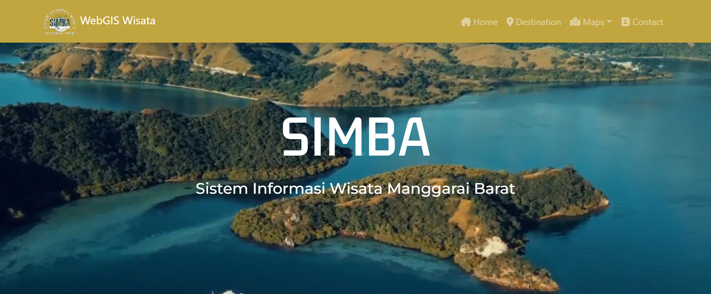
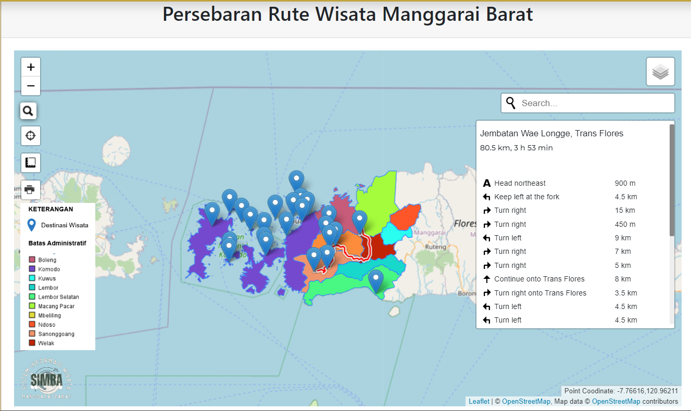
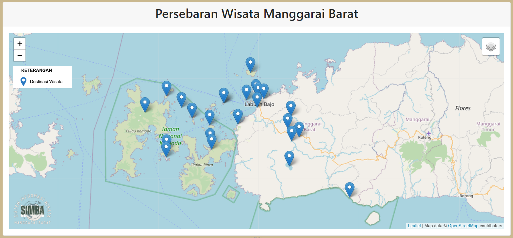
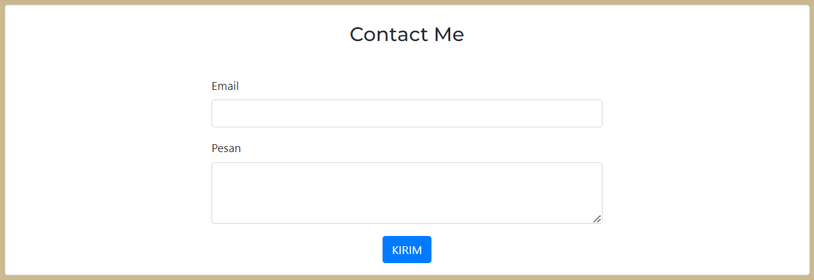

# responsi

<h2> SIMBA </h2>

<h3> Sistem Informasi Wisata Manggarai Barat</h3>

 SIMBA merupakan webgis yang berisi data wisata di Kabupaten Manggarai Barat, Provinsi Nusa Tenggara Barat. Kabupaten Manggarai Barat menyimpan menyimpan keindahan alam yang menakjubkan dan hewan purba yang mendunia. Mulai dari hewan endemik komodo di Pulau Rinca dan Pulau Komodo, deretan pulau eksotis, keragaman hayati bawah laut, hingga pantai. Wisata Kabupaten Manggarai Barat dapat diakses melalui jalur darat, laut, dan juga udara. Keindahan Pulau Komodo dengan kekayaan budaya lokal dan pulau-pulau eksotis di sekitarnya membuat Kabupaten Manggarai Barat menjadi tempat wisata yang potensial dan ramai dikunjungi.

<h3>Komponen Pembangun Produk</h3>

 1. Database persebaran wisata Kabupaten Manggarai Barat (PHPMyAdmin)
    2. Geoserver (Batas Administrasi)
    3. Bootstrap (Tampilan Website)
    4. HTML, PHP, CSS 
    5. Leaflet JS (Tampilan Peta)
    6. Google Font (Tampilan Tulisan)
    7. Fontawesome (Icon)

<h3>Sumber Data</h3>

 1. Data titik tempat wisata Kab Manggarai Barat dari Google Maps (PHPMyAdmin)
    2. Data Shapefile Kab Manggarai Barat dari InaGeoportal (Batas Administrasi)

<h3>Landing Page</h3>

<h3>Tampilan Peta</h3>

<h3>Tampilan Destinasi</h3>

<h3>Halaman Contact</h3>
